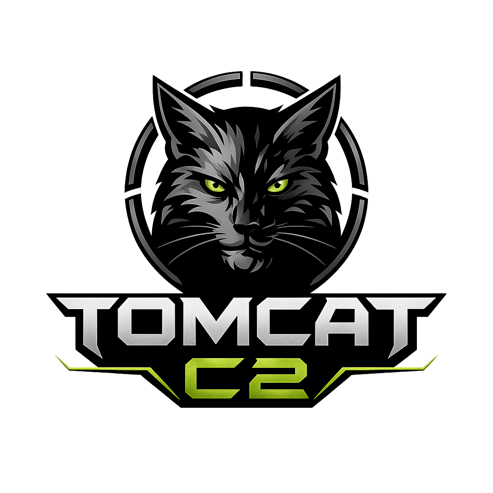

<h2 align="center">TOMCAT-C2 Framework Changelogs</h2>

---

## &target; V1.0

#### Date: 2025, April 16

- Initial Release

---

## &target; V1.5

#### Date: 2025, September 02

- Adding more interfaces type including CLI, GUI & WEB App
- Adding more agent/shell
- Adding mTLS connection
- Project structural update

---

## &target; V2.0

#### Date: 2026, Januari 08

- All interfaces update
- File transfer method added
- Adding elevation/base escalating command
- mTLS logic bug fixes from version 1.5

---

> Note: For all the version above currently is under development. If you spotted a bug, please contact me via email: `tomcat7wardns@gmail.com` or via: [instagram](https://instagram.com/xtm26.xp)

&copy; 2026 XTM26

